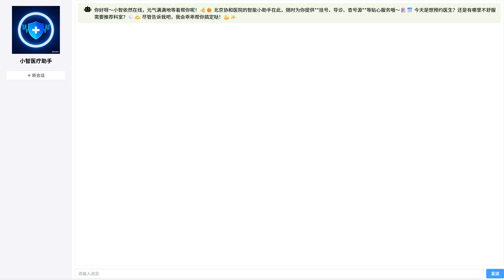

# 小智医疗助手 (Xiaozhi Medical Assistant)

## 项目简介

这是一个基于 Spring Boot 和 LangChain4j 的智能医疗助手项目，专门为医疗领域设计。项目集成了多种大语言模型（LLM）服务，提供专业的医疗咨询、健康问答、症状分析等智能医疗服务。

项目采用前后端分离架构：
- **后端**: Spring Boot + LangChain4j AI框架
- **前端**: Vue 3 + Element Plus + Vite


## 🏥 医疗助手特色功能

### 专业医疗咨询
- 症状分析和初步诊断建议
- 健康知识问答
- 用药指导和注意事项
- 医疗术语解释

### 智能对话系统
- 多轮对话记忆管理
- 流式输出响应
- 上下文感知对话
- 个性化医疗建议

### 医疗知识库
- 集成权威医疗知识
- 支持医疗文档处理
- RAG检索增强生成
- PDF医疗文档解析
- **Pinecone向量匹配**: 实现高效的向量相似度搜索
  - 医疗文档向量化存储
  - 语义相似度检索
  - 快速知识检索响应
  - 支持大规模医疗知识库

## 技术栈

### 后端技术栈
- **后端框架**: Spring Boot 3.2.6
- **AI框架**: LangChain4j 1.0.0-beta3
- **向量数据库**: Pinecone (集成LangChain4j-Pinecone)
- **数据库**: MySQL + MongoDB
- **ORM框架**: MyBatis Plus 3.5.11
- **API文档**: Knife4j 4.3.0
- **Java版本**: 17

### 前端技术栈
- **前端框架**: Vue 3.5.13
- **UI组件库**: Element Plus 2.8.4
- **构建工具**: Vite 5.4.8
- **HTTP客户端**: Axios 1.7.7
- **图标库**: Element Plus Icons Vue 2.3.1
- **唯一标识**: UUID 10.0.0

## 功能特性

### 🔥 多模型支持
- OpenAI 兼容模型（ChatGPT、DeepSeek等）
- Ollama 本地模型
- 阿里云百炼平台

### 📚 文档处理
- PDF 文档解析（Apache PDFBox）
- 简单的 RAG 实现
- Pinecone 向量数据库集成

### 💬 智能对话
- 流式输出支持
- 自定义提示词模板
- 多轮对话管理

### 🛠️ 工具集成
- 自定义工具函数
- 服务编排
- 数据持久化

## 项目结构

```
src/main/java/com/atguigu/java/ai/langchain4j/
├── XiaozhiApp.java          # 主启动类
├── assistant/               # 助手相关
├── bean/                    # 数据对象
├── config/                  # 配置类
├── controller/              # 控制器层
├── entity/                  # 实体类
├── mapper/                  # 数据访问层
├── service/                 # 业务逻辑层
├── store/                   # 存储相关
└── tools/                   # 工具函数
```

## 快速开始

### 环境要求

#### 后端环境
- JDK 17+
- Maven 3.6+
- MySQL 8.0+
- MongoDB 4.4+

#### 前端环境
- Node.js 16+
- npm 8+

### 安装步骤

#### 1. 克隆项目
```bash
git clone https://github.com/Zzcanhui/LLM-medical.git
cd java-ai-langchain4j
```

#### 2. 后端启动

**配置数据库**
- 创建 MySQL 数据库
- 配置 MongoDB 连接

**修改配置文件**
编辑 `src/main/resources/application.properties`，配置数据库连接和AI服务密钥。

**构建并运行后端**
```bash
# 构建项目
mvn clean install

# 运行后端服务
mvn spring-boot:run
```

#### 3. 前端启动

**进入前端目录**
```bash
cd xiaozhi-ui
```

**安装依赖**
```bash
npm install
```

**启动前端开发服务器**
```bash
npm run dev
```

#### 4. 访问应用

- **前端界面**: http://localhost:5173 (Vite默认端口)
- **后端API**: http://localhost:8080
- **API文档**: http://localhost:8080/doc.html

## 配置说明

### AI 服务配置

在 `application.properties` 中配置以下参数：

```properties
# OpenAI 配置
langchain4j.open-ai.chat-model.api-key=your-openai-key
langchain4j.open-ai.chat-model.model-name=gpt-3.5-turbo

# Ollama 配置
langchain4j.ollama.chat-model.base-url=http://localhost:11434
langchain4j.ollama.chat-model.model-name=llama2

# 阿里云百炼配置
langchain4j.dashscope.chat-model.api-key=your-dashscope-key

# Pinecone 向量数据库配置
langchain4j.pinecone.api-key=your-pinecone-api-key
langchain4j.pinecone.environment=your-pinecone-environment
langchain4j.pinecone.project-id=your-pinecone-project-id
langchain4j.pinecone.index-name=your-pinecone-index-name
```

### 数据库配置

```properties
# MySQL 配置
spring.datasource.url=jdbc:mysql://localhost:3306/ai_db
spring.datasource.username=root
spring.datasource.password=123456

# MongoDB 配置
spring.data.mongodb.uri=mongodb://localhost:27017/ai_db
```

## API 接口

### 医疗对话接口

**POST** `/xiaozhi/chat`

**功能**: 与医疗助手进行智能对话

**请求体**:
```json
{
  "memoryId": "会话ID（用于多轮对话记忆）",
  "message": "用户输入的问题或症状描述"
}
```

**响应**: 流式文本输出，支持实时显示

**示例**:
```bash
curl -X POST "http://localhost:8080/xiaozhi/chat" \
     -H "Content-Type: application/json" \
     -d '{"memoryId": "user123", "message": "我最近头痛，应该怎么办？"}'
```

## 使用示例

### 1. 医疗咨询对话

用户可以通过前端界面或API与医疗助手进行对话，描述症状获取专业建议。

### 2. 健康知识问答

基于集成的医疗知识库，回答用户关于健康、疾病、用药等方面的问题。

### 3. 症状分析

智能分析用户描述的症状，提供初步的诊断建议和就医指导。

## 开发指南

### 添加新的AI服务

1. 在 `pom.xml` 中添加对应的 LangChain4j starter 依赖
2. 在配置文件中添加服务配置
3. 创建对应的 Service 类

### 自定义工具函数

在 `tools/` 包下创建新的工具类，实现特定的功能逻辑。

### 提示词模板

在 `resources/` 目录下创建提示词模板文件，支持动态变量替换。

## API 文档

项目集成了 Knife4j，启动后访问 `http://localhost:8080/doc.html` 查看完整的API文档。

## 部署说明

### 开发环境

直接使用 Maven 运行：
```bash
mvn spring-boot:run
```

### 生产环境

1. 打包应用：
   ```bash
   mvn clean package -DskipTests
   ```

2. 运行JAR包：
   ```bash
   java -jar target/java-ai-langchain4j-1.0-SNAPSHOT.jar
   ```

## 故障排除

### 常见问题

1. **端口冲突**：修改 `application.properties` 中的 `server.port`
2. **数据库连接失败**：检查数据库服务是否启动，配置是否正确
3. **AI服务不可用**：检查网络连接和API密钥配置

### 日志查看

应用日志输出在控制台，详细日志可配置 `logback-spring.xml`。

## 贡献指南

欢迎提交 Issue 和 Pull Request 来改进项目。

## 许可证

本项目基于 MIT 许可证开源。

## 联系方式

如有问题请联系项目维护者。

---

**注意**: 使用AI服务时请遵守相关服务的使用条款和政策。